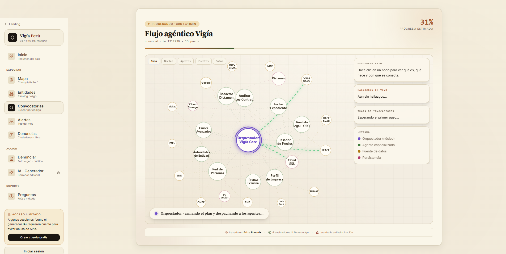
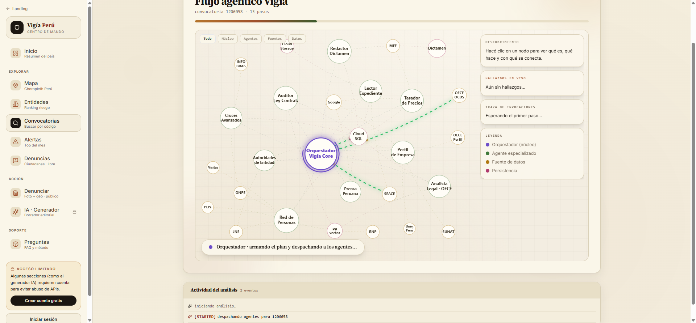
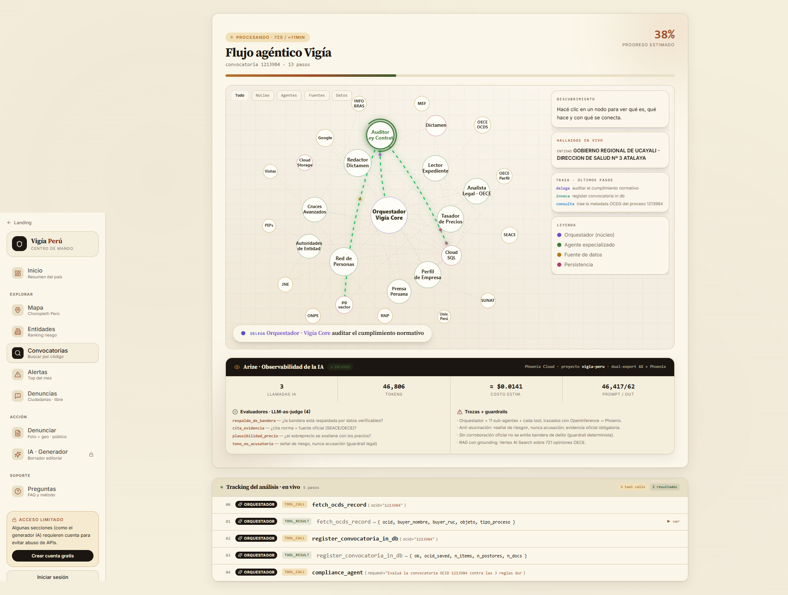
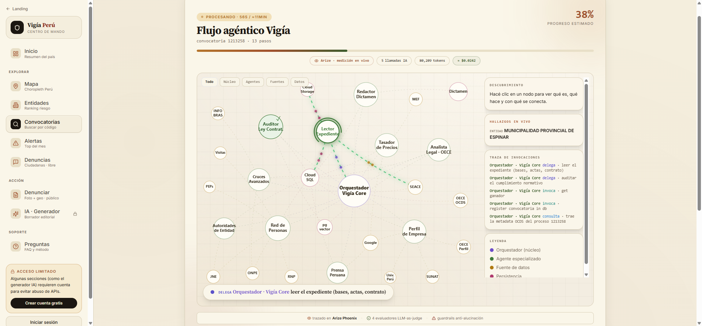

# 🛰️ Vigía Perú

### A civic anti-corruption platform that audits Peruvian public contracts with an **11-agent AI pipeline** — for **≈ 1 sol (US$0.30)** and **≈ 3 minutes** each.

> **Corruption in Peru is already public. Vigía makes it _readable_.**
> Every tender, every contract, every debarred company is already open data on SEACE/OECE.
> The bottleneck was never the data — it was the **cost** of reading it. Vigía drops that cost
> to the price of a coffee.

🔗 **Live demo:** https://vigia-peru-frontend-36169102688.us-central1.run.app
📊 **Observability (Arize Phoenix):** project `vigia-peru`

---

## 🎯 The problem

Investigating **a single** suspicious state contract takes a journalist **days**: 80-page scanned
PDFs scattered across a dozen `.gob.pe` portals that don't talk to each other (SEACE, OECE, SUNAT,
INFOBRAS, ONPE, JNE…). There are **thousands** of new contracts every month. Oversight is a slow,
heroic act that doesn't scale.

## 💡 The solution

Vigía Perú is a three-layer platform:

| Layer | What it does |
|---|---|
| 🟡 **Machine** | 11 AI agents read the bidding file, cross-check open data, and emit **risk signals** on suspicious contracts — each one **linked to its official source**. |
| 🔴 **Citizen** | Anyone reports a stalled or anomalous public work with a **photo + geolocation**. |
| ⬛ **Convergence** | When an automated alert and a citizen report point at the **same work**, the case turns "red": evidence ready for a journalist or prosecutor. |

Everything is plotted on an **interactive map of Peru**: 🟡 alert · 🔴 citizen report · ⬛ convergence.

> **Non-negotiable principle:** we never accuse anyone. We say *"risk signal"*, never *"crime"*.
> No verifiable link to an official source → it is not published.



---

## 🏗️ Architecture

```
 USER ──► FRONTEND (Next.js, Cloud Run) ──NDJSON stream──► ADK ORCHESTRATOR (Cloud Run)
   ▲                │                                            │  ADK Runner + Gemini 2.5
   │   GET dossier  │                                            ▼
   │                ▼                            ┌──────────────────────────────────┐
   │      Read API (Hono/TS, Cloud Run)          │       11-AGENT PIPELINE            │
   │      + cache + gzip   ◄── reads ─┐           └──────┬────────┬────────┬──────────┘
   │                                  │                  ▼        ▼        ▼
   └──────────────────────────────────┤            Document AI  Vertex    SUNAT
                                       │             (PDF OCR)   AI Search (apis.net.pe)
                              Cloud SQL (PostgreSQL        │     (RAG: 721
                              + PostGIS): alerts,          │      OECE opinions)
                              flags, network, pins         ▼
                                                  OECE/SEACE (OCDS + PDFs)
                                                  via residential relay in Lima
```

### The 11 agents (Google ADK)

A **coordinator** delegates to specialized sub-agents; each runs on **Gemini 2.5**:

`orchestrator` (coordinates) · `compliance` (hard rules) · `document_parser` (OCR + line items) ·
`document_legal_analyst` (OECE RAG) · `market_analyst` (price vs market) · `web_research`
(company profile) · `person_network` (partners/representatives) · `political_financing` (ONPE) ·
`news_research` (press) · `citizen_reports` (red pins) · `report_writer` (verdict) ·
`evaluator` (self-eval).



---

## 🗄️ Data

Vigía combines a **local snapshot of Peru's public-procurement lifecycle** with **live external
sources**. Full breakdown in [`docs/DATA.md`](docs/DATA.md).

### Primary dataset — SEACE/OECE procurement (OCDS), 2026 snapshot (~2.5M rows)

The complete lifecycle of a Peruvian public contract, keyed end-to-end by `codigoconvocatoria`:

| Phase | Tables | Join key |
|---|---|---|
| Planning | `plan_anual_contratacion` (PAC) | `ruc_entidad` + description |
| Call for bids | `datos_de_la_convocatoria`, `miembros_comite`, `nulos`, `procesos_desiertos` | `codigoconvocatoria` |
| Bidding | `listado_de_ofertantes`, `proveedores_y_consorcios` | `codigoconvocatoria`, `ruc_postor` |
| Award | `datos_de_adjudicacion`, `contratacion_directa` | `codigoconvocatoria`, `ruc_proveedor` |
| Execution | `contratos`, `ordenes_compra_y_servicio` | `codigoconvocatoria`, `ruc_contratista` |
| Post-control | `arbitraje`, `PRONUNCIAMIENTOS` | `codigoconvocatoria` |
| Master data | `entidades_contratantes`, `rnp_proveedores`, `sanciones`, `sican_certificados`, `opiniones_normativas` | RUC, DNI |

The **721 OECE normative opinions** (`opiniones_normativas`) are indexed in **Vertex AI Search**
and power the legal-grounding RAG: every compliance finding cites the specific opinion it relies on.

### Live external sources (selection)

| Source | Used for | Access |
|---|---|---|
| **OECE — Contrataciones Abiertas** | Contracts in **OCDS** format | REST API + downloads |
| **SUNAT** (via `apis.net.pe` / decolecta) | Company tax-ID (RUC) age & status | REST API |
| **INFOBRAS** (Comptroller) | Public-works progress | Web/downloads |
| **MEF** (Consulta Amigable / Datos Abiertos) | Budget (PIA, PIM, executed) | CSV/scrape |
| **ONPE — Portal Claridad** | Campaign contributions | Web |
| **JNE** | Officials' CVs | Web + PDFs |

### Risk cross-checks (the alert engine)

The MVP implements **C1 (RUC age vs winner)** and **C2 (single bidder at 100% of the reference
value)**, plus hard compliance rules (sanctioned/debarred provider, direct award without valid
grounds, addenda > 25% of original amount, etc.). Each red flag cites its legal basis (Law 32069 /
Law 30225) and the relevant OECE opinion.

> ⚠️ **The raw local dataset is _not_ in this repo** — it is ~739 MB and contains personal data
> (the RNP registry includes partners'/representatives' names and national IDs). Publishing it
> would violate our own ethics rule #2 ("we do not publish citizens' personal data"). We reference
> the **official open-data sources** instead. See [`docs/DATA.md`](docs/DATA.md).

---

## ☁️ Google Cloud services used

| Service | Purpose |
|---|---|
| **Vertex AI** | Gemini 2.5 (Flash + Flash-Lite), **global endpoint** — the reasoning engine for all 11 agents |
| **Agent Development Kit (ADK)** | Multi-agent orchestration (coordinator + `transfer_to_agent`) |
| **Vertex AI Search** | Semantic RAG over **721 OECE normative opinions** (legal grounding) |
| **Document AI** | OCR of bidding-file PDFs (per-use, imageless mode) |
| **Cloud Run** | Frontend, read API, orchestrator, and MCP server |
| **Cloud Functions (gen2)** | Orchestrator entrypoint (Cloud Run-backed) |
| **Cloud SQL (PostgreSQL + PostGIS)** | Procurement lifecycle, alerts, flags, corporate network, geospatial pins |
| **Cloud Storage** | Document & report staging |
| **Secret Manager** | All credentials (no plaintext keys in the codebase) |
| **Cloud Build + Artifact Registry** | Container builds & deploys |
| **Cloud Logging / Monitoring** | Pipeline observability |
| **Firebase Authentication** | Demo login |

---

## 🤖 Models

| Model | Role |
|---|---|
| **Gemini 2.5 Flash** (Vertex AI, global) | Main agent reasoning and verdict writing |
| **Gemini 2.5 Flash-Lite** (Vertex AI, global) | Fast extraction / lightweight steps |
| **Document AI** (OCR processor) | Scanned-PDF text → fed to Gemini in **a single call** per document |
| **Vertex AI Search** | Embeddings + retrieval over the OECE legal corpus |

**Why the Vertex `global` endpoint?** New projects hit aggressive per-region throttling (429); the
global endpoint routes across regions and fixed exactly that, letting document-heavy tenders finish
without hitting the time wall.

---

## 📊 Observability — and why **Arize** matters

Trust in an 11-agent system depends on being able to **see and evaluate every decision**.

- **OpenInference** instruments the **ADK Runner** (the full loop + every `transfer_to_agent`
  between agents) and **every Gemini call**. Everything is exported over OTEL to **Arize AX** and
  **Arize Phoenix** (project `vigia-peru`).
- The result: a **full span tree per OCID** — tokens, cost, latency, and prompt/response for each
  step. If an agent hallucinates or drifts, it shows up in the trace.
- **Inline self-eval**: at the end of each analysis, **6 evaluators** run (4 LLM-as-judge +
  2 deterministic): flag support, evidence citation, price plausibility, object↔items coherence,
  **non-accusatory tone**, and pipeline completeness.

> Arize turns an agentic black box into an **auditable, evaluable** system — a prerequisite for
> journalists and prosecutors to trust the signals.




---

## 💰 Cost and ⏱️ latency (measured)

| Metric | Value |
|---|---|
| **Cost per full analysis** | **≈ 1 sol (≈ US$0.30)** |
| **Latency per analysis** | **≈ 3 minutes** (depends on document weight) |
| Gemini calls per run | ≈ 12 |
| Tokens per run | ≈ 180K in + 80K out (≈ 245K total) |
| OCR | per-use (Document AI), only the actual pages of the file |

**Cost/latency optimizations implemented:**
- **Document AI + one Gemini call per document** (previously: page-by-page Vision).
- **Per-URL parse cache** — the same PDF is never OCR'd/parsed twice in a run.
- **Semantic line-item dedup** — the same item is never priced twice against the market.
- **Read ≠ write** — cached dossiers are served by a lightweight gzip API; the (expensive)
  orchestrator only runs **new** analyses.
- **Persistence checkpoint** before the verdict — a timeout never leaves an empty dossier.

---

## 🧱 Stack

| Layer | Technology |
|---|---|
| Frontend | Next.js 14 · React · TailwindCSS · Leaflet/OpenStreetMap |
| Read API | Hono (TypeScript) · cache · gzip |
| Orchestrator | Python · Google ADK · functions-framework |
| AI | Gemini 2.5 (Vertex AI global) · Document AI · Vertex AI Search |
| Data | Cloud SQL (PostgreSQL + PostGIS) · DuckDB (local analysis) |
| Observability | OpenInference · OpenTelemetry · Arize AX + Phoenix |
| Integration | Custom **MCP** server (Cloud Run) · residential relay (FastAPI) |

---

## 📁 Repository layout

```
vigia-peru/
├── frontend/                          # Web app (Next.js 14): map, dossiers, citizen reports
├── functions/agent-orchestrator-adk/  # 11-agent orchestrator (Python + ADK)
│   ├── agents/                        #   one subfolder per agent (prompt + config)
│   └── tools/                         #   OCDS, Document AI, market, legal RAG, persistence
├── api/                               # Read API (Hono/TS) over Cloud SQL
├── downloader/                        # Residential relay in Lima (FastAPI) — .gob.pe WAF bypass
├── services/vigia-mcp/                # Remote MCP server (exposes data as read-only tools)
├── docs/
│   ├── DATA.md                        # Data sources, tables, join keys (detailed)
│   └── img/                           # Architecture & observability screenshots
├── ARQUITECTURA.md                    # GCP architecture + production roadmap (ES)
├── SOLUCION.md                        # How it works: end-to-end data flow (ES)
└── OBSERVABILITY.md                   # Observability setup detail — Arize track (ES)
```

---

## ⚖️ Non-negotiable rules (legal + ethical)

1. **We never accuse anyone** — "risk signal" / "detected pattern", never "crime".
2. **We never publish citizens' personal data** — only serving officials and companies that
   contract with the State (public by law).
3. **We do not replace the Comptroller / Prosecutor / journalism** — we detect and prioritize.
4. **Citizen reports**: two independent reports within ≤30 days to be "confirmed"; no photo → not
   published.
5. **No ads, no data monetization** — open source, non-profit.
6. **Every flag links to official evidence** (SEACE/OECE/MEF URL, contract code, OECE opinion
   number). No verifiable link → not published.

---

## 🚀 Running locally (overview)

Each component ships a `.env.example`. In broad strokes:

```bash
# Frontend
cd frontend && npm install && cp .env.example .env.local && npm run dev

# Read API
cd api && npm install && cp .env.example .env && npm run dev

# Orchestrator (requires GCP / Vertex AI credentials)
cd functions/agent-orchestrator-adk && pip install -r requirements.txt
```

> Credentials (Cloud SQL, Vertex, Document AI, Arize/Phoenix) live in environment variables or
> Secret Manager — **never** in the repo.

---

## 📍 Status

Hackathon MVP — **Transparency & Corruption** track. Full machine layer + citizen form + map, over
a pilot region. Roadmap to national coverage, report moderation, and Comptroller/Prosecutor
hand-off in [`ARQUITECTURA.md`](ARQUITECTURA.md).

---

*Open source · non-profit · built for Peru.* 🇵🇪
